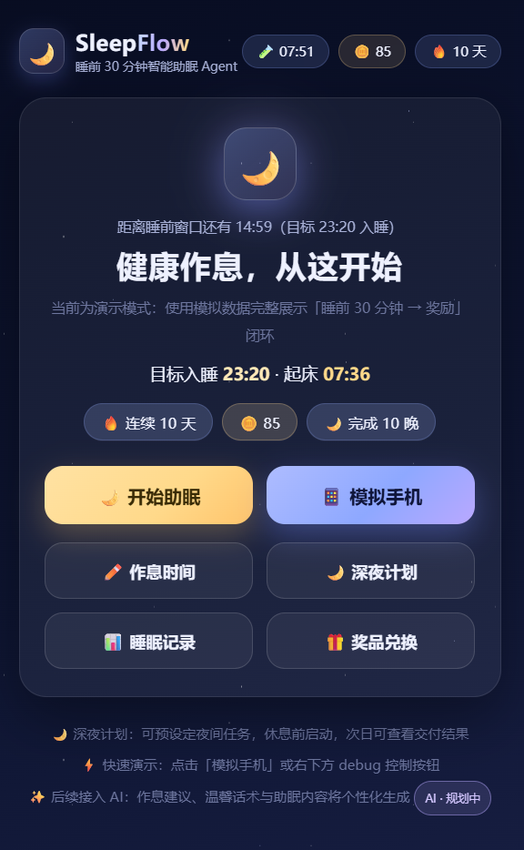
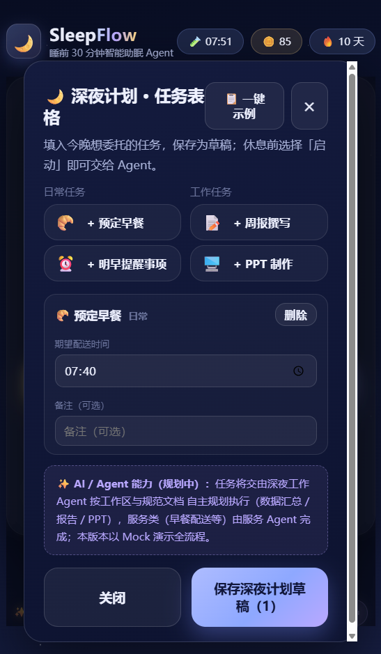

# SleepFlow · A 30-Minute Bedtime Companion Agent (MVP / Demo)



**Healthier routines start here — SleepFlow gently walks you from "one more video" to "good night."**

A bedtime agent built for young professionals: it opens a **30-minute wind-down window** before your target
sleep time, uses **gentle multi-stage interventions**, hands repetitive late-night work to **deep-night
Agents**, and closes the loop with **Sleep Coins / streaks** the next morning.

> MVP demo mode: everything runs in the browser with Mock device data. The LLM layer keeps an
> **OpenAI-compatible interface** (no API key needed in demo mode) and falls back to rule-based copy
> automatically.

<br clear="left"/>

[中文文档（Chinese README）](./README.zh-CN.md)

---

## 1. Product Overview

### What it does

| Stage | What SleepFlow does |
| --- | --- |
| 🧭 **Routine setup** | First-run wizard configures target bedtime / wake time and a draft "Deep-Night Plan" |
| 📱 **Phone scenario** | A fullscreen mock phone shows a TikTok-style feed (`tiktok.mp4`); permission dialogs are simulated (notifications / media control / background monitor) |
| ⏰ **Automatic reminders** | At **T-30** the video is **paused** with a small reminder → "one more minute" waits 6 min → auto-switches to a **healthy-sleep video** (`sleep.mp4`) → a third nudge opens the Deep-Night Plan |
| 🌙 **Deep-Night Plan** | Configure tasks at home (daily: breakfast delivery with a pick time; work: weekly report / PPT with **workspace + spec document**). Start it before sleep; agents work while you rest |
| 😴 **Sleep Mode** | Choose music / story / quiet rest; mock player with a countdown; 1h without phone = sleep success |
| ☀️ **Next-morning rewards** | **+10 Sleep Coins**, streak +1, **delivery dashboard** ("breakfast on the way", "weekly report ready — tap to view", "PPT done") |
| 🎁 **Rewards shop** | Mock products incl. a **10-coin warm breakfast** that can **auto-order takeaway** with live delivery status (placed → accepted → rider → delivering → delivered) |
| 📊 **Sleep records & AI notes** | History (incl. **missed-sleep records with a −5 coin penalty**), AI sleep suggestions (roadmap) |

### Core technology

- **Rule Engine controls determinism** — every state transition is validated
  (`IDLE → BEDTIME_START → STAGE_1/2/3 → SLEEP_MODE → SLEEP_SUCCESS → REWARD`).
- **LLM adds intelligence (interface-ready)** — OpenAI-compatible client (`base_url`/`key`/`model`),
  JSON-schema validated output, automatic fallback to Mock on any failure.
- **SQLite stores memory** — profiles, sessions, interventions, rewards, deep-night plans, shop orders, missed-sleep records.
- **Virtual demo clock** — "enter the 30-min window / +6 min / +1 hour / next morning / reset" so the whole loop can be presented in minutes.
- Backend: **FastAPI + SQLite (Python 3.11)** · Frontend: **React 18 + TypeScript (strict) + Vite 5**
- 23 backend pytest cases · strict `tsc` build

---

## 2. Feature Showcase

A compressed demo video (≈ 2 MB) and two screenshots are committed under `docs/media/`.
Click the video cover to play it in GitHub's native MP4 player, or open the file directly:
[**`docs/media/demo.mp4`**](https://github.com/AIHU13/SleepFlow/blob/main/docs/media/demo.mp4).

| ▶️ Demo video | 🏠 Home | 🌙 Deep-Night Plan |
| :---: | :---: | :---: |
| [](https://github.com/AIHU13/SleepFlow/blob/main/docs/media/demo.mp4)<br/>*Click the cover to play* |  |  |

---

## 3. Quick Start

### Environment

| Dependency | Version | Notes |
| --- | --- | --- |
| Python | 3.11 | dedicated conda env `sleepflow` created for this project |
| Node.js | ≥ 18 (tested on 24) | frontend build & dev server |
| npm | ≥ 10 | on Windows use `npm.cmd` (`.ps1` shims may be blocked) |

```bash
# 1) Backend deps (create the env first if it does not exist)
conda create -n sleepflow python=3.11 -y
conda activate sleepflow
pip install -r backend/requirements.txt

# 2) Frontend deps
cd frontend
npm install
```

### Run (two terminals)

**Terminal 1 — FastAPI backend :8000**

```bash
conda activate sleepflow
cd backend
uvicorn app.main:app --reload --port 8000
```

The DB (`data/sleepflow.db`) and seed data (23:30 / 07:30, music+story preferences) are created automatically.
Interactive API docs: <http://127.0.0.1:8000/docs>

**Terminal 2 — Vite frontend :5173**

```bash
cd frontend
npm run dev
```

Open **<http://localhost:5173>** → the first-run **setup wizard** appears (bedtime + Deep-Night Plan example)
→ Home → tap **📱 模拟手机 (Mock Phone)** for the auto-reminder story, or follow the normal demo chain:

```
Home (target 23:30) → 开始助眠 → pick 正在刷短视频 / 仍在工作 / 已准备休息
  → Stage 1/2/3 gentle reminders → 好了，去休息
  → 深夜计划? 是/否/修改计划 → choose music/story/quiet → Sleep Mode
  → 模拟 1 小时 → Sleep Success → 模拟第二天 → Reward (+10 / streak / delivery dashboard)
```

Optional phone-scenario videos (9:16, loopable): put `tiktok.mp4` and `sleep.mp4`
under `frontend/public/videos/` (fallback placeholders are shown when missing).

### Configuration (`.env`, optional)

Copy `.env.example` to `.env` at the repo root. Defaults to demo mode:

```env
SLEEPFLOW_LLM_MODE=demo                     # demo = Mock copy, no key needed
SLEEPFLOW_LLM_MODE=live                     # enable real OpenAI-compatible LLM
SLEEPFLOW_OPENAI_BASE_URL=https://api.deepseek.com/v1
SLEEPFLOW_OPENAI_API_KEY=sk-xxxx
SLEEPFLOW_LLM_MODEL=deepseek-chat
```

Rules: LLM output must pass schema validation; any timeout / bad format falls back to Mock so the demo never breaks.

### Tests & build

```bash
cd backend && python -m pytest tests -q          # 23 tests
cd frontend && npm run build                     # tsc strict + vite build
```

---

## 4. Project Structure

```text
sleepflow/
├── README.md                 # this file (English, default)
├── README.zh-CN.md           # 中文说明
├── .env.example
├── docs/media/               # showcase screenshots / demo video (placeholders)
├── backend/
│   ├── app/
│   │   ├── main.py           # FastAPI app (CORS, error mapping, routers)
│   │   ├── config.py         # settings from .env
│   │   ├── clock.py          # time utils + demo virtual clock
│   │   ├── api/              # routes_user / session / agent / reward / demo / shop / deep-night / work / food
│   │   ├── agent/            # state machine + Rule Engine / policy / prompt / planner (LLM→Mock)
│   │   ├── services/         # session / intervention / content / reward / shop / deep_night / work
│   │   ├── models/           # SQLite DDL + dataclasses (user/session/intervention/reward/miss/shop/deep_night/work)
│   │   ├── schemas/          # Pydantic request/response contracts
│   │   ├── mock/             # mock users / scenarios / shop / deep-night catalog
│   │   └── db/               # connection + init & seeds
│   ├── tests/                # 23 pytest cases (state rules, full demo chain, deep-night, miss penalty…)
│   └── requirements.txt
├── frontend/
│   ├── src/
│   │   ├── pages/            # Home / Scenario / Intervention / SleepMode / Reward / Record / Shop / PhoneSim
│   │   ├── components/       # Sky / TopBar / DemoControl / SleepPrepModal / PlanAskModal / DeepNightConfig / SetupWizard …
│   │   ├── api/              # typed endpoint client
│   │   ├── styles/global.css # dark night-sky theme (mobile-slim 460px content)
│   │   └── App.tsx           # screen router driven by backend session state
│   ├── public/videos/        # local demo videos: tiktok.mp4 (TikTok-like), sleep.mp4 (health)
│   └── package.json
└── data/                     # sleepflow.db (auto-created at runtime)
```

---

## 5. Remaining Notes

### Architecture & design rules

```
Browser (React UI) → REST → FastAPI → Session Service / Rule Engine / SQLite
                                        ↓
                                   Agent Planner
                                   /          \
                              LLM API     Mock LLM (fallback)
                                   \          /
                                    ↓
        Intervention → Sleep Mode → Feedback → Reward → History → next-night decisions
```

- **Rule Engine owns control** (time / state / transition safety, 409 on illegal actions); **LLM only writes copy & suggestions**; frontend never mutates core business state.
- **Everything can be demoed in a browser** — all waits are simulated (demo virtual clock / buttons), including the phone takeover story.
- No medical diagnosis advice, no unnecessary RAG / multi-agent / ML (roadmap items are clearly labeled "AI · planned").

### Main REST endpoints

| Method | Path | Purpose |
| --- | --- | --- |
| GET | `/api/session/current` | AppState: profile + clock + home + session (+ onboarding flag) |
| POST | `/api/session/start` | start tonight's session (idempotent) |
| POST | `/api/agent/start` / `act` | pick scenario (shorts/working/ready) & act (continue / prepare_sleep) |
| POST | `/api/plan/config` / `activate` | save draft tasks / start Deep-Night Plan |
| GET | `/api/plan/session` / `report` | plan summary / next-morning delivery dashboard |
| POST | `/api/reward/settle` / `miss` | next-morning reward (+10, streak) / missed-sleep penalty (−5) |
| POST | `/api/shop/redeem` · `/api/food/order` | redeem goods (incl. 10-coin breakfast) & auto takeaway order |
| POST | `/api/demo/enter-window` / `advance` / `next-day` / `reset` | demo virtual clock |

### Acceptance walkthrough (demo)

- Home shows routine & countdown → enter 30-min window → 3 scenarios recognized
- Entertainment scenario: 3-stage gentle interventions; Stage-2 "6-minute" simulation
- Sleep Mode → simulate 1h unused → Sleep Success → next-morning reward (+10, streak +1, deep-night delivery)
- Refresh-safe: session restored from backend; history incl. missed-sleep records persists
- LLM live personalization works when a key is configured; demo runs flawlessly without it

### License

This project's code is open-sourced under the MIT License, while the author reserves all rights for
**commercial closed-source versions** of the code (本项目代码基于 MIT 协议开源，作者同时保留商业闭源版本的全部权利).

Product names (Disney, HUAWEI, etc.) appear only as **mock shop items** to demonstrate the incentive
loop and are not affiliated with their owners.
