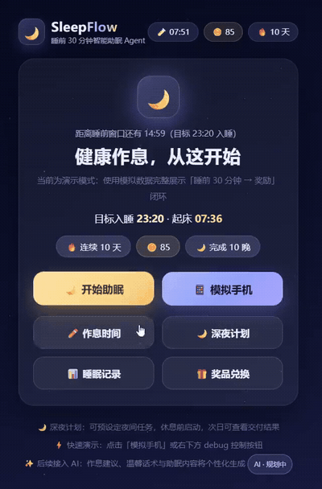

# OKSleep · 睡前 30 分钟智能助眠 Agent（MVP / Demo）


**健康作息，从这开始 —— OKSleep 陪你把「再刷一条」变成「晚安」。**

面向年轻用户的睡前助眠 Agent：在你目标入睡前的 **30 分钟窗口** 主动介入，用
**循循善诱 + 分阶段干预 + 奖励闭环** 帮你完成「继续刷手机/工作 → 准备休息 → 进入睡眠」的切换；
深夜的重复性工作（周报、PPT、早餐配送）可交给 **深夜工作/服务 Agent**；次日用
**积分与连续打卡** 形成持续激励。

> MVP 演示模式：全部在浏览器内使用 Mock 数据运行。LLM 层保留 **OpenAI 兼容接口**（演示模式无需
> API Key），任何调用失败都会自动回退到规则文案，演示永不中断。

<br clear="left"/>

[English README](./README.md)

---

## 1. 项目简介

### 产品功能

| 环节 | OKSleep 做什么 |
| --- | --- |
| 🧭 **作息与首次配置** | 首次启动引导：入睡/起床时间 + 深夜计划草稿（可一键示例） |
| 📱 **手机场景模拟** | 全屏手机拟真「抖音」页面（本地 tiktok.mp4 循环播放），含系统权限声明（通知 / 媒体控制 / 后台监测） |
| ⏰ **睡前自动提醒** | 到达 **T-30** 自动**暂停视频**并弹小窗提醒 → 「再刷一会儿」6 分钟后**自动切换健康睡眠视频**（sleep.mp4，提供 返回 / 好了去休息）→ 第三次进入深夜计划说明 |
| 🌙 **深夜计划** | 首页表格化配置：日常（预定早餐，指定配送时间 / 明早提醒）与工作（周报撰写、PPT 制作，需指定**工作区**与**规范文档**）；休息前选择 是/否/修改计划 启动，Agent 夜间自主执行 |
| 😴 **助眠模式** | 音乐 / 睡前故事 / 安静休息任选；模拟播放与倒计时，连续 1 小时不使用手机判定睡眠成功 |
| ☀️ **次日奖励** | **+10 Sleep Coins**、连续打卡 +1；**深夜计划交付看板**（早餐配送中 / 周报已生成点击查看 / PPT 已完成点击查看） |
| 🎁 **积分兑换区** | Mock 商品（含 **10 积分暖心早餐**，可一键**自动下单外卖**并实时展示接单/配送动态） |
| 📊 **睡眠记录与 AI 建议** | 历史记录（含**助眠失败记录并扣除 5 积分**）、AI 睡眠建议（规划中标注） |

### 核心技术

- **Rule Engine 保证可控**：所有状态流转经校验（`IDLE → BEDTIME_START → STAGE_1/2/3 → SLEEP_MODE → SLEEP_SUCCESS → REWARD`）
- **LLM 负责智能（接口就绪）**：OpenAI 兼容客户端（base_url/key/model），输出过 Schema 校验，失败自动回退 Mock
- **SQLite 保存记忆**：作息、会话、干预、奖励、深夜计划、兑换订单、助眠失败记录
- **Demo 虚拟时钟**：「进入睡前 30 分钟 / +6 分钟 / +1 小时 / 模拟第二天 / 重置」，几分钟即可完整演示闭环
- 后端 **FastAPI + SQLite（Python 3.11）** · 前端 **React 18 + TypeScript（严格）+ Vite 5**
- 后端 **23 项 pytest** 全部通过 · 前端严格 `tsc` 构建通过

---

## 2. 功能展示

下方为**自动循环播放的 GIF 预览**，内嵌于页面、打开即可直接观看（无需点击播放）。
它截取自完整演示视频 `docs/media/demo.mp4`（已压缩至约 2 MB，49 秒）；
需要高清完整版本时，点击链接在 GitHub 原生播放器中打开：
[**`docs/media/demo.mp4`**](https://github.com/AIHU13/OKSleep/blob/main/docs/media/demo.mp4)。

<p align="center">
  <a href="https://github.com/AIHU13/OKSleep/blob/main/docs/media/demo.mp4"></a>
  
  
</p>
<p align="center"><i>▶ 演示视频（自动播放）· 🏠 首页 · 🌙 深夜计划 —— 点击左侧预览打开完整视频</i></p>

---

## 3. 快速开始

### 环境配置

| 依赖 | 版本 | 说明 |
| --- | --- | --- |
| Python | 3.11 | 已为本项目创建专属 conda 环境 `oksleep` |
| Node.js | ≥ 18（实测 24） | 前端构建与运行 |
| npm | ≥ 10 | Windows 请用 `npm.cmd`（系统禁用 .ps1） |

```bash
# 1) 后端依赖（新机器先创建环境）
conda create -n oksleep python=3.11 -y
conda activate oksleep
pip install -r backend/requirements.txt

# 2) 前端依赖
cd frontend
npm install
```

### 启动（两个终端）

**终端 1：后端 FastAPI（端口 8000）**

```bash
conda activate oksleep
cd backend
uvicorn app.main:app --reload --port 8000
```

首次启动自动建库并写入默认用户（入睡 23:30 / 起床 07:30 / 偏好 音乐+故事）。
接口文档：http://127.0.0.1:8000/docs

**终端 2：前端 Vite（端口 5173）**

```bash
cd frontend
npm run dev
```

打开 **http://localhost:5173** → 首次出现**配置向导**（作息 + 深夜计划示例）→ 首页 →
点 **📱 模拟手机** 体验自动提醒主链，或走标准演示流程：

```
Home（目标 23:30）→ 开始助眠 → 选择 刷短视频 / 仍在工作 / 已准备休息
  → Stage 1/2/3 温和提醒 → 好了，去休息
  → 深夜计划：是/否/修改计划 → 选 音乐/故事/安静 → Sleep Mode
  → 模拟 1 小时 → Sleep Success → 模拟第二天 → Reward（+10 / 打卡 / 交付看板）
```

手机场景本地视频（可选，9:16 可循环）：将 `tiktok.mp4`、`sleep.mp4` 放入
`frontend/public/videos/`（缺失时显示拟真占位，不影响演示）。

### 配置（.env，可选）

复制 `.env.example` 为 `.env`（仓库根目录）。默认 demo 模式：

```env
OKSLEEP_LLM_MODE=demo                     # demo=Mock 文案，无需任何 Key
OKSLEEP_LLM_MODE=live                     # 启用真实 OpenAI 兼容 LLM
OKSLEEP_OPENAI_BASE_URL=https://api.deepseek.com/v1
OKSLEEP_OPENAI_API_KEY=sk-xxxx
OKSLEEP_LLM_MODEL=deepseek-chat
```

规则：LLM 输出必须过 Schema 校验；超时/格式错误自动回退 Mock，Demo 永不中断。

### 测试与构建

```bash
cd backend && python -m pytest tests -q     # 23 项
cd frontend && npm run build                # tsc 严格 + vite build
```

---

## 4. 项目结构

```text
oksleep/
├── README.md                 # 英文说明（默认，适合推送 GitHub）
├── README.zh-CN.md           # 中文说明（本文件）
├── .env.example
├── docs/media/               # 展示截图 / 演示视频（占位）
├── backend/
│   ├── app/
│   │   ├── main.py           # FastAPI 入口（CORS / 异常映射 / 路由注册）
│   │   ├── config.py         # .env 配置
│   │   ├── clock.py          # 时间工具 + Demo 虚拟时钟
│   │   ├── api/              # user / session / agent / reward / demo / shop / deep-night / work / food
│   │   ├── agent/            # 状态机 + Rule Engine / policy / prompt / planner（LLM→Mock）
│   │   ├── services/         # session / intervention / content / reward / shop / deep_night / work
│   │   ├── models/           # 建表 DDL + dataclass（user/session/intervention/reward/miss/shop/deep_night/work）
│   │   ├── schemas/          # Pydantic 出入参
│   │   ├── mock/             # mock 用户 / 场景 / 商品 / 深夜计划目录
│   │   └── db/               # 连接与初始化（含种子数据）
│   ├── tests/                # 23 项 pytest（状态规则/主链/深夜计划/失败扣分…）
│   └── requirements.txt
├── frontend/
│   ├── src/
│   │   ├── pages/            # Home / Scenario / Intervention / SleepMode / Reward / Record / Shop / PhoneSim
│   │   ├── components/       # Sky / TopBar / DemoControl / SleepPrepModal / PlanAskModal / DeepNightConfig / SetupWizard …
│   │   ├── api/              # 类型化端点封装
│   │   ├── styles/global.css # 深色夜空主题（内容 460px 贴近手机）
│   │   └── App.tsx           # 由后端 Session 驱动的页面编排
│   ├── public/videos/        # 本地演示视频：tiktok.mp4（抖音样片）、sleep.mp4（健康助眠）
│   └── package.json
└── data/                     # oksleep.db（运行时自动创建）
```

---

## 5. 其余必要说明

### 架构与设计规则

```
Browser（React UI）→ REST → FastAPI → Session Service / Rule Engine / SQLite
                                        ↓
                                   Agent Planner
                                   /          \
                              LLM API     Mock LLM（回退）
                                   \          /
                                    ↓
        Intervention → Sleep Mode → Feedback → Reward → History → 次日 Agent 决策
```

- **Rule Engine 负责可控**（时间 / 状态 / 流转安全，非法操作返回 409）；**LLM 只做文案与建议**；前端不修改核心业务状态
- **一切等待均可演示**：Demo 虚拟时钟 + 按钮模拟（含手机接管提醒场景），浏览器内跑通完整闭环
- 不提供医疗诊断建议；不引入无实际价值的 RAG / 多 Agent / 机器学习（路线能力均标注「AI · 规划中」）

### 主要接口

| 方法 | 路径 | 说明 |
| --- | --- | --- |
| GET | `/api/session/current` | AppState：profile + clock + home + session（含是否首次配置） |
| POST | `/api/session/start` | 开始今晚助眠（幂等） |
| POST | `/api/agent/start` `/act` | 选择场景（shorts/working/ready）与行为（continue / prepare_sleep） |
| POST | `/api/plan/config` `/activate` | 保存深夜计划草稿 / 启动计划 |
| GET | `/api/plan/session` `/report` | 会话要点 / 次日交付看板 |
| POST | `/api/reward/settle` `/miss` | 次日结算（+10、打卡）/ 助眠失败扣分（−5） |
| POST | `/api/shop/redeem` · `/api/food/order` | 兑换商品（含 10 积分早餐）与自动下单外卖 |
| POST | `/api/demo/enter-window` `/advance` `/next-day` `/reset` | Demo 虚拟时钟 |

### 演示验收走查

- 首页展示作息与倒计时 → 进入睡前 30 分钟 → 识别三种模拟场景
- 娱乐场景三阶段温和干预；Stage 2 支持「模拟 6 分钟」
- Sleep Mode → 模拟 1 小时未使用手机 → Sleep Success → 次日奖励（+10、打卡 +1、深夜计划交付）
- 刷新页面 Session 由后端恢复不丢失；历史（含助眠失败记录）可持久化
- 配置 Key 后 LLM 可实时个性化；未配置 Key 时 Demo 仍完整运行

### 许可声明

本项目代码基于 **MIT 协议开源**，作者同时保留**商业闭源版本的全部权利**。
许可全文见仓库根目录 `LICENSE` 文件。

文中出现的品牌名（迪士尼、华为等）仅作为**积分兑换区的 Mock 商品**用于演示激励闭环，与各品牌方无关。
